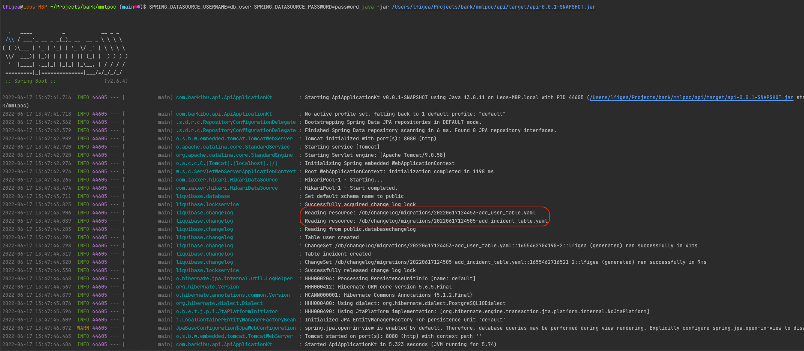

# spring-multimodule-db-splat

This repository is a proof of concept to try and get a liquibase setup in a multimodule maven projects.

## Why ?

Microservice are nice for testability but hard on infra/deployment/monitoring. The middle ground for small teams is the
modular monolith. A monolith today that can be easily splat into separate services if needed.

Consider you want to split your project into various modules. Each module touches a separate domain context and could on
the long run be extracted into separated microservices. Each module will have its own Domain Models and will need some
kind of persistence.

Liquibase is of great help in the generation of the database change sets, but we do not want to couple all the modules
when it comes to persistence because that would mean they are not easily extractable one from another into separate
apps.

## Objectives

- We want a common liquibase configuration for each module but each module holds its change sets.

- We want each module to play with its own tables based on the entities defined in its package.

- We want to be able to generate changeset for each module individually, allowing development to be parallelized on the
  modules.

## How ?

The parent pom is providing a [liquibase configuration template](./pom.xml#L72-L103) as pluginManagement, each module
that needs persistence can include the plugin configuration by simply referencing the artifact in its build section.

As any multimodule maven project, you need to start by a `mvn clean install` so each module is installed into the local
repository, making them available to run goals on specific modules having dependencies on another submodule later on.

### Expected DB Related Code Structure

For each module that will want to access the DB we need to:

- add the liquibase-maven-plugin as build dependency inheriting the parent pom configuration.
- create a src/main/resources/db/changelog/${ModuleName}-changelog-master.yaml file registering the individual change
  sets
- create a src/main/resources/db/changelog/migrations folder which will hold all the individual change sets
- create a src/main/resources/db/${ModuleName}-liquibase.properties file holding the module specific liquibase
  configuration (containing the hibernate database reference used for diff generation)

### Adding a new entity

Head to the module you want to add your entity to and add your class with the JPA Entity annotation:

```kt
package com.barkibu.mmlpoc.api

/***/

@Entity
class User(
  @Id
  @GeneratedValue(strategy = GeneratedValueType.AUTO)
  val id: Int,
  val name: String
) 
```

Generating a change set:

```bash
make makeMigration MIGRATION_LABEL=add_user_table MODULE=api
```

This will generate
a [changelog in the api module](api/src/main/resources/db/changelog/migrations/20220617124453-add_user_table.yaml) with
the associated change set detected.

### Launching the Spring Boot Application

In this example the Api module depends on the dataentry module. The launchable jar that we want to run and for which we
want the migration run is the one build in api/target.

As each module register the migration to the same classpath (db/changelog/migrations) the resulting jar contains all the
migration required for our database, we can check this by launching the package:

```bash
java -jar api/target/api-0.0.1-SNAPSHOT.jar
```

